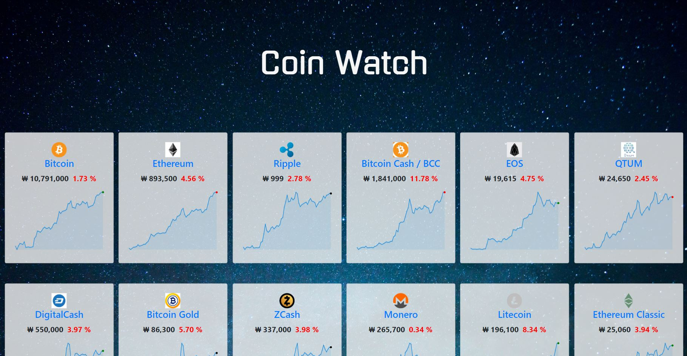
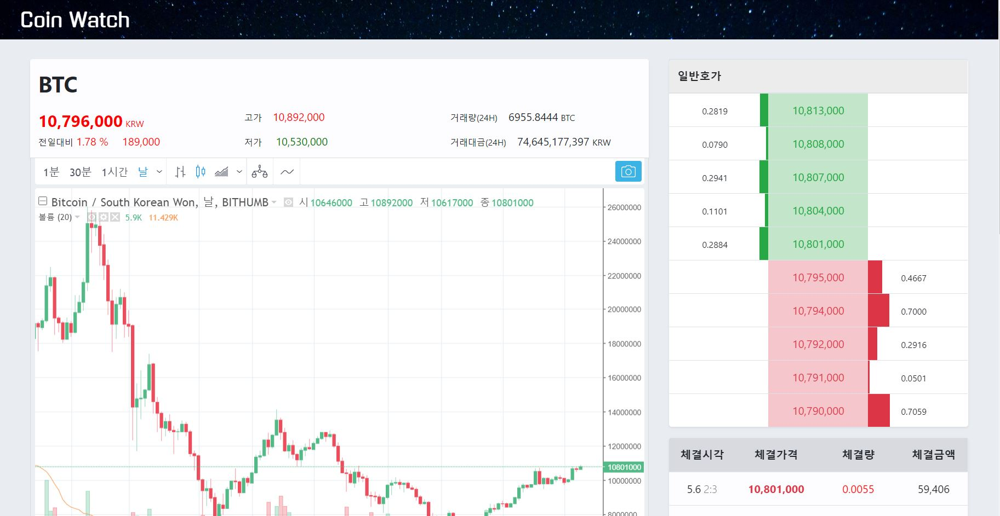

# Coinwatch_web

## Table of Contents

1. [개발 환경](#개발-환경)
2. [Getting Started](#getting-started)
3. [Folder Structure](#folder-structure)
4. [Screenshots](#screenshots)
   - [coin_home](#coin_home)
   - [coin_show](#coin_show)
5. [Todo](#todo)

## 개발 환경

- React(v16.3.1) + Redux(v3.7.2)
- node.js(v8.10.0), html, css, Bootstrap4
- [cyptocompare api](https://www.cryptocompare.com/api/)
- [bithumb api](https://www.bithumb.com/u1/US127)

## Getting Started

```
$ npm install
$ npm start
```

**Note** -   If loading animation continues when you start this project, install this chrome extensions : https://chrome.google.com/webstore/detail/allow-control-allow-origi/nlfbmbojpeacfghkpbjhddihlkkiljbi?utm_source=chrome-ntp-icon

and turn on *Enable cross-origin resource sharing* in the settings of this program. 

## Folder Structure

```
Coinwatch_web/
  ~
  src/
    actions/
      index.js
    components/
      chart_in_coin_home.js
      chart_in_coin_show.js
      coin_card.js
      coin_info_tabs.js
      coin_info_top.js
      coin_list.js
      contracts.js
      header_home.js
      header_show.js
      order_book.js
    containers/
      coin_home.js
      coin_show.js
    img/
      sky.jpg
    reducers/
      coin_list_reducer.js
      coin_reducer.js
      index.js
    App.css
    App.js
    index.css
    index.js
```


## Screenshots

#### *coin_home*



```
┌--------------------------coin_home.js--------------------------┐
| ┌-----------------------header_home.js-----------------------┐ |
| |                                                            | |
| └------------------------------------------------------------┘ |
| ┌------------------------coin_list.js------------------------┐ |
| | ┌coin_card.js┐                                             | |
| | |            |                                             | |
| | └------------┘                                             | |
| |                                                            | |
| |                                                            | |
| |                                                            | |
| |                                                            | |
| └------------------------------------------------------------┘ |
└----------------------------------------------------------------┘
```

<br>

#### *coin_show*



```
┌--------------------------coin_show.js--------------------------┐
| ┌-----------------------header_show.js-----------------------┐ |                              
| └------------------------------------------------------------┘ |
| ┌-----------coin_info_top.js------------┐  ┌--order_book.js--┐ |
| |                                       |  |                 | |
| └---------------------------------------┘  |                 | |
| ┌--------chart_in_coin_show.js----------┐  |                 | |		  	
| |                                       |  └-----------------┘ |		
| |                                       |  ┌--contracts.js--┐  |
| |                                       |  |                |  |
| └---------------------------------------┘  |                |  |
| ┌----------coin_info_tabs.js------------┐  |                |  |
| |                                       |  |                |  |
| └---------------------------------------┘  └----------------┘  |
└----------------------------------------------------------------┘
```

<br>

## Todo

##### 18-04-20

- [x] 이름 card-title 넣기
- [x] input-button 정리 & 중앙정렬
- [x] PRICE 3자리 , 구분
- [x] change24Hprice

> ##### error  "_" is not defined  no-undef
>
> .eslintrc.json  아래와 같이. 그리고 파일 상단에 /* global _ */

```json
{
    "globals": {
        "_": false
    }
}
```

나중에 와서 생각해보니 lodash였던듯...


해야할 것

- 자꾸 전체 다 다시 리로드됨.. 가격만 바뀔때로

  

##### 18-04-24

- [x] card 투명하게

- [x] TradingView chart 넣기(api) -> 

- [x] coin 설명하는 tab 넣기

- [x] containers 나누기

- [x] details, list reducer/action

- [x] coinlist 불러와서 full name으로 바꿈

- [x] coin img 넣기 -> api img에 흰배경.................................

- [x] 배경이미지 바꿈

  ​

> 참고 : https://github.com/rafaelklaessen/react-tradingview-widget

> 이미지 public/img/~에 넣었더니 src/에 넣어야 된다고 에러남.

> 
>
> ##### Failed to load https://www.cryptocompare.com/api/data/coinlist/: No 'Access-Control-Allow-Origin' header is present on the requested resource.
>
> js의 동일 출처 정책 때문. 크롬에 아래 플로그인 설치
>
> https://chrome.google.com/webstore/detail/allow-control-allow-origi/nlfbmbojpeacfghkpbjhddihlkkiljbi?utm_source=chrome-ntp-icon


해야할 것

- tab 클릭이 안 됨(해결)

- 이름 옆에 이미지를 두고 싶음..

- 차트 종가로 라인 그리기

  

##### 18-04-26

- [x] 코드 정리 (검색창 어떻게 할 것인지 생각해보기..)

- [x] CoinHome - CoinShow 나눔

- [x] 각 코인마다 차트 바꿈

- [x] CoinShow - sticky header

- [x] 정보 탭따로 components로 나눔

- [x] 탭 클릭


> 참고 : https://github.com/yahoo/react-stickynode
>
> https://github.com/jonjaques/react-loaders

> 탭 안눌린 것 -> 부트스트랩 js script 안넣어서
>
> show페이지에 symbol, id 다 필요한데 이걸로 fetchCoinList 하기 그럼...


해야할 것

- 탭 로딩

- css불편해서 sass..깔까 고민중...

  

##### 18-05-01

home에 작은 차트 하나씩 그리고 싶었는데 api coin 하나씩 콜해야됨.... 

- [x] %에 색 넣기


> key, _grid가 undefined -> return을 안씀..
>
> object 합칠 때 {...state.data, coins: action.payload.data.RAW} 있어야 하나봄.. 순서 중요.
>
> card 따로 component로 만들었는데 grid-layout 적용이 안됨..


##### 18-05-02

- [x] 호가창
- [x] 차트 크기 맞추기
- [x] show top의 가격 있는 곳 component로 만들기
- [x] coin_info_top 정리
- [x] 체결창

>toFixed -> number로 바꿔서
>
>reducer에서 object 합칠 때 이름 따로 주는 법 있나? -> 해결
>
>호가창 table 안에 table로 넣기 -> colgroup 안됨..
>
>td안에 div height=0 
>
>호가창 div에 text가 밀림 -> position
>
>체결시간 월-일 시-초 만 -> date로 바꿔서 get~ (month +1 / getDate) moment사용할까...


##### 18-05-03

- [x] 호가창 움직이도록
- [x] card만 fetchcoin할 수 있도록
- [x] 경고 정리
- [x] home grid 고침..
- [x] home 에 차트 넣기
- [x] 그리드 정리
- [x] data있는데 그냥 계산으로 한 것 정리하기

> row로 push하니깐 다시 render가 안되는 것 같음... 바꾸자.. -> reducer가 잘못됨.....{} 합칠 때 순서.... 그래도 slice로 정리해서 깔끔해짐..
>
> 그리드 안 된 이유 -> div로 감싸야....
>
> grid 깜빡깜빡.. -> reducer에서 loading, error, data 없앴으면서 state.data에 object 더했음..


##### 18-05-04

- [x] reducer 정리
- [x] 탭 title 설정
- [x] loding 추가
- [x] 호가창 수량 뒤에 상자 고침 
- [x] package 정리

> 졸면서 과제했더니 전체적으로 이상해짐 무언가......다음부터그러지말아야지...
>
> title 주소바뀔 때 업데이트가 안됨 -> react-meta-tags 로 방법 바꿈


##### 18-05-05

> [eslint] 'Fragment' is not defined. (react/jsx-no-undef ) -> react에서 Fragment import
>
> 검색창 overflow x -> header가 fixed되어야됨...
>
> searchbar div들 끼리 겹침 -> width 설정
>
> typeahead 하다가 포기........자동완성...


마지막으로 해야할 일 : README 비우기